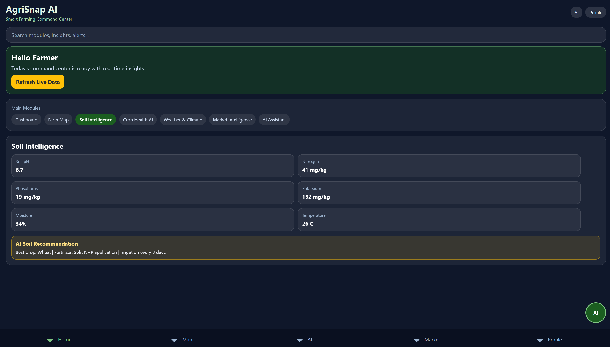
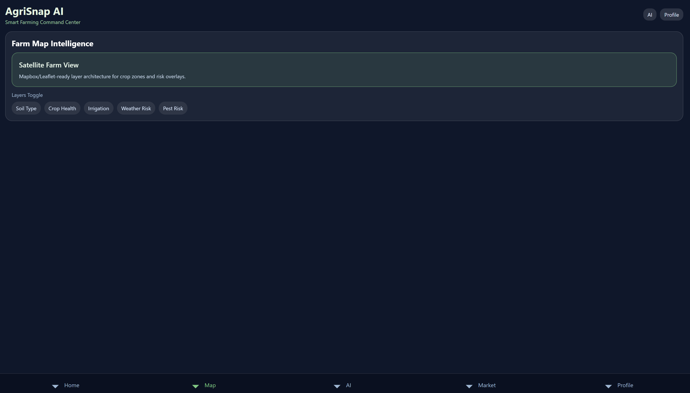
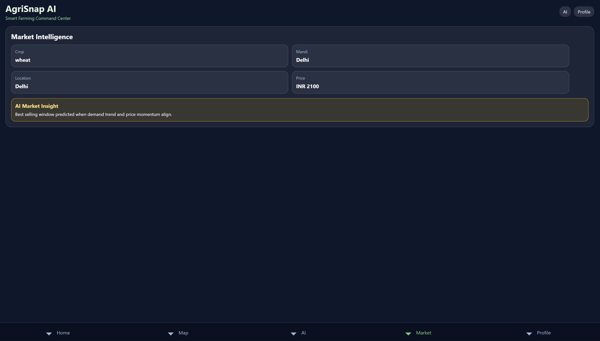
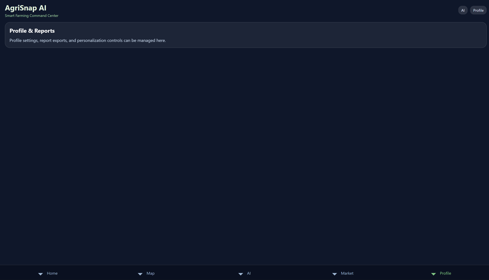
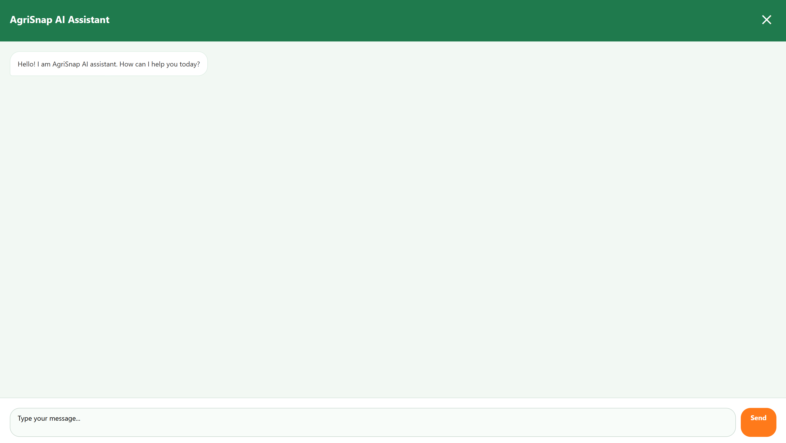

# AgriSnap

AgriSnap is a full-stack agriculture platform that combines:

- a React Native (Expo) frontend,
- a Django REST backend,
- a PostgreSQL database,
- and a Rasa chatbot service.

The app focuses on farmer support workflows such as crop disease reporting, advisory, market visibility, and assistant-based guidance.

## Screenshots







---

## 1) High-Level Architecture

The repository is organized as a multi-service application:

- **Frontend (`frontend/`)**: Expo + React Native UI.
- **Backend (`backend/`)**: Django + DRF API for auth, disease reports, and utility endpoints.
- **Database (`db` service)**: PostgreSQL (in Docker Compose).
- **Rasa (`rasa/`)**: conversational AI service exposed via REST API.
- **Orchestration**: `docker-compose.yml` starts and wires all services.

Default local endpoints:

- Backend API: `http://localhost:8000/api`
- Django admin/API root: `http://localhost:8000/`
- Rasa API: `http://localhost:5005`
- Expo dev server: terminal output shows the local/tunnel URL (`19000/19001/19002` ports are mapped in Docker)

---

## 2) Repository Structure

```text
Agri-snap-main/
├─ backend/
│  ├─ agrosnap/                 # Django project config (settings, urls, wsgi, asgi)
│  ├─ api/                      # Main API app (models, serializers, views, urls)
│  │  ├─ __init__.py
│  │  ├─ admin.py
│  │  ├─ apps.py
│  │  ├─ migrations/
│  │  ├─ models.py              # CropDiseaseReport model
│  │  ├─ serializers.py        # User, Register, CropDiseaseReport serializers
│  │  ├─ urls.py                # API URL patterns
│  │  └─ views.py               # API views for auth, prediction, reports, market, weather
│  ├─ media/                    # Uploaded images/reports
│  ├─ model/                    # ML model folder (example: model.h5)
│  ├─ manage.py
│  ├─ requirements.txt
│  ├─ Dockerfile
│  └─ .env
├─ frontend/
│  ├─ App.js                    # Main landing UI with header, hero, features, 5 A's, digital solutions, footer, chatbot
│  ├─ Chatbot.js                # In-app assistant modal UI with simulated AI responses
│  ├─ package.json
│  └─ dockerfile
├─ screenshots/                 # Application screenshots
│  ├─ agrisnap-pic-1.png
│  ├─ agrisnap-pic-2.png
│  ├─ agrisnap-pic-3.png
│  ├─ agrisnap-pic-4.png
│  └─ agrisnap-pic-5.png
├─ rasa/                        # Rasa workspace (service volume mount target)
├─ docker-compose.yml
├─ setup.bat / setup.ps1        # Dependency/tool checks
├─ start.bat / start.ps1        # Start full stack via Docker Compose
└─ stop.bat / stop.ps1          # Stop full stack
```

---

## 3) Backend (Django + DRF)

### 3.1 Tech Stack

- Python
- Django `4.2.7`
- Django REST Framework `3.14.0`
- `django-cors-headers`
- `python-dotenv`
- `Pillow`
- `psycopg2-binary`

### 3.2 Main Components

- **Project settings**: `backend/agrosnap/settings.py`
  - CORS enabled for Expo local ports
  - Media/static configuration included
  - Database configured to SQLite for local development (PostgreSQL available via Docker)
  - REST framework and authtoken configured
  - `api` app added to INSTALLED_APPS
- **API routing**: `backend/agrosnap/urls.py` and `backend/api/urls.py`
  - Main URLs include `api.urls` under `/api/` path
- **Domain model**: `backend/api/models.py`
  - `CropDiseaseReport` model stores:
    - User (ForeignKey, optional)
    - Image (ImageField, upload_to='disease_reports/')
    - Prediction (CharField, max_length=200)
    - Confidence (FloatField)
    - Timestamp (DateTimeField, auto_now_add=True)
- **Serialization**: `backend/api/serializers.py`
  - `UserSerializer`: id, username, email fields
  - `RegisterSerializer`: username, password with create() method
  - `CropDiseaseReportSerializer`: all fields except prediction, confidence, timestamp are read-only
- **Business/API handlers**: `backend/api/views.py`
  - `register`: POST endpoint for user registration, returns user + token
  - `get_token`: POST endpoint for authentication, returns token + user
  - `predict`: POST endpoint for disease prediction (currently mocked)
  - `reports`: GET endpoint for retrieving reports (filtered by user if authenticated)
  - `market_prices`: GET endpoint returning mocked market price data
  - `weather_info`: GET endpoint returning mocked weather data
- **Admin interface**: `backend/api/admin.py`
  - `CropDiseaseReportAdmin` registered with list_display, list_filter, and search_fields

### 3.3 Backend API Endpoints

Base path: `/api/`

- `POST /api/auth/register/`
  - Registers a user with username/password.
  - Returns user + DRF token.
- `POST /api/auth/token/`
  - Authenticates existing user.
  - Returns token + user details.
- `POST /api/predict/`
  - Accepts multipart `image`.
  - Creates and returns a `CropDiseaseReport`.
  - Current implementation returns mocked prediction values.
- `GET /api/reports/`
  - Returns reports.
  - Authenticated users get their own reports; unauthenticated gets all.
- `GET /api/market-prices/`
  - Returns mocked market price data.
- `GET /api/weather/`
  - Returns mocked weather data.
- `POST /api/soil/recommend/`
  - Stores soil reading and returns AI soil recommendation payload.
- `POST /api/irrigation/recommend/`
  - Returns irrigation plan from soil + weather signals.
- `POST /api/yield/predict/`
  - Returns baseline yield/profit/risk prediction for a farm crop.
- `POST /api/digital-twin/simulate/`
  - Runs scenario simulation for rainfall/fertilizer/irrigation changes.
- `GET /api/dashboard/summary/`
  - Returns farm health summary metrics for dashboard cards.
- `POST /api/integrations/weather/ingest/`
  - Pulls weather forecast from external weather API and stores `WeatherData`.
- `POST /api/integrations/market/ingest/`
  - Pulls external mandi/market prices and stores `MarketPrice`.
- `POST /api/integrations/satellite/ingest/`
  - Stores satellite observation payload with stress/drought insight response.
- REST CRUD routes (router-backed):
  - `/api/farms/`, `/api/crops/`, `/api/soil-data/`, `/api/weather-data/`
  - `/api/market-data/`, `/api/satellite-observations/`
  - `/api/irrigation-schedules/`, `/api/yield-predictions/`, `/api/digital-twin-simulations/`

### 3.4 Admin

- Django admin is enabled at `/admin/`.
- `CropDiseaseReport` is registered with list filters/search in `backend/api/admin.py`.

---

## 4) Frontend (React Native + Expo)

### 4.1 Tech Stack

- Expo
- React `18`
- React Native `0.73.x`
- React Native Web

### 4.2 Main UI Modules

- `frontend/App.js`
  - **Header**: AgriSnap branding with logo and menu button
  - **Hero Section**: Main landing area with "Solution for farmers" tagline and "Get Started" button
  - **Features Section**: Grid of feature cards highlighting key platform benefits
  - **5 A's Section**: "5 A's we offer to Empower Farmers" - Access to Quality Input, Market, Advisory Services, Finance, and Services
  - **Digital Solution Section**: Accordion-style sections for Soil Testing, Farm Tagging, and Crop Advisory
  - **Footer**: Comprehensive footer with company links, social icons, and contact information
  - **Chatbot Integration**: Floating chatbot button that opens a modal for AI assistance
  - All branding updated from "Kisaan" to "AgriSnap"
  - All download app links removed per user requirements
- `frontend/Chatbot.js`
  - Modal chat interface with header and close button
  - Message bubbles for user and bot messages
  - Local message state and simple response rules
  - Simulated AI responses for disease detection, market prices, seeds, weather, soil testing, and general help
  - Designed for quick farmer-assistant interactions

### 4.3 Current Frontend Behavior Notes

- Branding in UI is AgriSnap.
- Chat responses are simulated in the frontend layer.
- API integration scaffolding exists conceptually, but several flows currently display static/mock data.

---

## 5) Rasa Service

- Docker service uses image `rasa/rasa:3.6.17`.
- Runs with:
  - `run --enable-api --cors * --debug`
- Exposed at `http://localhost:5005`.
- Repository currently mounts `./rasa` into container as working directory.

---

## 6) Docker Services and Networking

Defined in `docker-compose.yml`:

- `db` (Postgres 15 alpine)
- `backend` (Django app on `8000`)
- `rasa` (Rasa API on `5005`)
- `frontend` (Expo dev stack on `19000/19001/19002`)

Persistent volumes:

- `db_data`
- `media_data`
- `model_data`

Startup dependencies:

- backend waits for healthy Postgres before launching migrations + server.

---

## 7) Environment Variables

### 7.1 Backend `.env`

Current `backend/.env` includes:

- `MODEL_PATH=backend/model/model.h5`
- `DEBUG=True`
- `SECRET_KEY=...`
- `USE_POSTGIS=False` (enable PostGIS database backend when true)
- `POSTGRES_HOST`, `POSTGRES_PORT`, `POSTGRES_DB`, `POSTGRES_USER`, `POSTGRES_PASSWORD`
- `OPENWEATHER_API_KEY`, `OPENWEATHER_BASE_URL`
- `MARKET_API_BASE_URL`, `MARKET_API_KEY`
- `ML_INFERENCE_URL`, `ML_INFERENCE_TIMEOUT_SECONDS`

### 7.2 Compose DB Defaults

If not supplied externally, Docker Compose defaults to:

- `POSTGRES_DB=agrosnap`
- `POSTGRES_USER=agrosnap`
- `POSTGRES_PASSWORD=agrosnap`

### 7.3 Frontend Environment

- Frontend supports Expo runtime environment variables (e.g. `EXPO_PUBLIC_API_URL`) if needed for LAN/device testing.

---

## 8) Setup and Run Guide

### Option A: Full stack via Docker (recommended)

### Windows

1. Run prechecks:
   - `setup.bat` or `.\setup.ps1`
2. Ensure model file exists (if used by your ML pipeline):
   - `backend/model/model.h5`
3. Start everything:
   - `start.bat` or `.\start.ps1`
4. Stop everything:
   - `stop.bat` or `.\stop.ps1`

### Linux/macOS

```bash
docker compose up --build
```

Stop:

```bash
docker compose down
```

### Option B: Run frontend/backend locally (without full Compose)

### Backend

```bash
python -m venv .venv
.venv\Scripts\activate      # Windows
pip install -r backend/requirements.txt
python backend/manage.py migrate
python backend/manage.py runserver
```

### Frontend

```bash
cd frontend
npm install
npm start
```

---

## 9) Core Functional Flows

1. **User authentication**
   - Register/login via token endpoints.
2. **Disease report submission**
   - User uploads crop image to `/api/predict/`.
   - Backend stores report + returns prediction payload.
3. **Report retrieval**
   - `/api/reports/` returns persisted report history.
4. **Advisory data**
   - Weather and market endpoints expose helper data (currently mocked).
5. **Assistant interaction**
   - Frontend chatbot modal provides rule-based guidance UI.
   - Rasa service is available for conversational backend integration.

---

## 10) Development Commands (Quick Reference)

From repository root:

- Start full stack: `docker compose up --build`
- Stop full stack: `docker compose down`

Backend:

- Install deps: `pip install -r backend/requirements.txt`
- Migrate DB: `python backend/manage.py migrate`
- Run server: `python backend/manage.py runserver`

Frontend:

- Install deps: `cd frontend && npm install`
- Start Expo: `cd frontend && npm start`

---

## 11) Known Gaps / Implementation Status

- `/api/predict/` currently returns mock prediction values ("Healthy Crop" with 0.95 confidence)
- `market-prices` endpoint returns mock data for wheat, rice, maize, cotton, and soybean
- `weather` endpoint returns mock weather data (temperature, humidity, condition, rainfall, wind_speed)
- Rasa integration hooks are service-level; frontend chat is currently local UI logic with simulated responses
- `frontend/dockerfile` uses a generic Node dev command pattern, while Compose overrides command to Expo start
- All "download app" links have been removed from the frontend
- All branding has been updated from "Kisaan" to "AgriSnap" throughout the frontend
- The "Experience Farmer App Section" with mobile number input has been removed from the frontend

---

## 12) Suggested Next Improvements

- Replace mocked prediction in `predict` endpoint with real model inference pipeline.
- Add API auth/permission hardening for report visibility and write actions.
- Add automated tests (backend API tests + frontend component/integration tests).
- Add CI for lint/test/build checks.
- Add production-grade env separation and secrets management.

---

## 13) License / Ownership

No explicit license file is present in this repository snapshot.  
Add a `LICENSE` file if you plan to distribute or open-source the project.